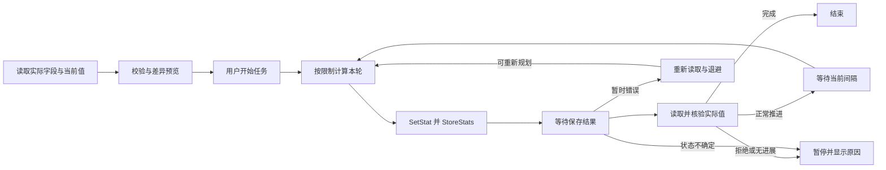

# Steam 统计提交、限制与自适应重试

核对日期：2026-09-09。本文是开发方案研究，不代表已实现功能或 Windows／Steam 实测结果。

## 官方已确认的行为

| 问题 | 官方文档与结论 |
| --- | --- |
| 最快能多久提交一次？ | `StoreStats` 可能被限流。官方建议调用频率为分钟级，没有公布最快间隔、固定配额窗口或保证可用的最短时间。 |
| 设置值是否立即上传？ | `SetStat` 只改变 Steam 内存中的值，`StoreStats` 才请求上传。`SetStat` 接收绝对值，不会自动执行加法。 |
| `maxchange=1` 是每分钟加 1 吗？ | 不是时间额度。官方定义是相邻 `SetStat` 调用之间允许的最大变化量。 |
| 提交函数返回 `true` 是否等于最终成功？ | 不能据此报告最终成功。还需等待 `UserStatsStored_t` 结果，并读取实际值进行核验。 |
| `StoreStats` 返回 `false` 时是否返回原因？ | 同步返回只有布尔值，没有错误细节；官方说明这时没有发送到服务器。之前设置的内存值并不因此回滚。 |
| 过快是否一定有专用错误码？ | 该接口没有承诺限流固定对应哪个错误码。通用 `EResult` 中存在临时限流、繁忙等结果，只有实际收到时才能据此分类。 |
| 回调是否附带被拒绝字段和当前数值？ | 没有。`UserStatsStored_t` 只有 GameId、Result；`UserStatsReceived_t` 只有 GameId、Result、SteamIdUser。它们不包含逐字段数值、最大允许值或建议等待时间。 |
| `InvalidParam` 后会怎样？ | 官方说一个或多个统计因违反约束或数据过时被拒绝，服务器会发回更新值。程序需要读取同步后的值并重新校验，不能一律解释为请求太快。 |
| 退出能否取消尚未保存的内存改动？ | 不能保证。Steam 会在应用退出时尝试自动保存待提交统计。停止按钮只能停止后续轮次。 |

`StoreStats` 原文：

> This call can be rate limited. Call frequency should be on the order of minutes, rather than seconds.

`Max Change` 原文：

> If set, sets a limit on the amount that the stat's value can change from one SetStat call to the next.

因此，120 秒仅是可调整的初始工程参数。此前按“每轮加 1、每 120 秒保存一次”计算出的数月耗时，只属于这种调度方案的估算，不是 Steam 规定的必然耗时。

## 最快速度应如何研究

需要分别测量两件事，不能只调一个定时器：

1. **单次允许提交的变化量。** 先验证当前字段是否确实允许客户端设置，再验证小步设置、服务器确认和最终读回。只有确认能持久保存的增量才记为有效进展。
2. **连续保存可持续接受的间隔。** 记录每轮开始时间、同步结果、回调结果、回调耗时、读回值、失败次数，以及最近稳定的间隔。

同一轮可以合并多个不同字段，然后调用一次 `StoreStats`，以减少保存请求。官方并未保证“同一字段先在内存连续加很多个 1，再保存一次”一定能让累计大增量通过服务器；若以后研究此方法，必须单独记录调用过程并核验持久结果，不能提前把它作为已支持的提速能力。

文档没有公开的精确速度，无法从文档直接得到，也不能通过一次成功的快速请求证明。未来 Windows 验证可以测出当前 AppId、字段、账号和运行环境下的**观察到的稳定区间**。间隔可能随服务器负载、窗口累计请求和连接状态改变。

本次只建立仓库与方案，未进行实际统计写入、间隔探测或账号试验。未来验证应在用户选定的字段和目标上进行，记录成功与失败，而不是通过无进展的重复请求持续探测。

## 自适应调度提案

以下为待验证的产品设计，不是 Steam 官方阈值。

- 默认从分钟级间隔开始，初始建议 120 秒。界面显示当前间隔、历史稳定间隔及依据。
- 同时只允许一个未决保存请求；“等到下一轮”与“等待本轮回调”分开显示。
- 收到明确临时失败后，先重新读取，确认最终状态，再将等待间隔加倍，例如 120 → 240 → 480 秒；加入小幅随机偏移，重试次数建议最多 5 次。
- 连续多轮成功且每次读回符合预期后，可以小幅恢复到先前已验证的稳定间隔。进一步提速属于单独验证模式，不能把“失败就更快试一次”混入普通任务。
- 第一次迭代只自动恢复到已验证间隔，不默认探测秒级保存；官方推荐仍为分钟级。若将来提供更激进的探测选项，需重新审查依据并明确其不稳定性。
- 成功次数、退避上限、最短间隔等参数应通过真实日志再确定，文档不预先宣称某个秒数可用。

### 错误分类

| 实际结果 | 处理提案 |
| --- | --- |
| `StoreStats == false` | 记录“未发送，原因未提供”。保留目标，检查连接与初始化状态，重新读取后决定有限退避；不假定已经收到明确限流。 |
| `OK (1)` | 请求或读取最新状态，逐字段核验本轮目标；核验通过才更新确认值及进度。 |
| `InvalidParam (8)` | 读取修正值，重载真实 schema，检查 min/max、incrementonly、maxchange、字段权限与类型。允许在新起点合法且原因已澄清时重新规划；重复被拒绝的字段暂停。 |
| `Busy (10)` | 通用定义为繁忙且未采取动作；如果确实收到，可作为暂时错误退避处理。 |
| `RateLimitExceeded (84)` | 通用定义明确为暂时限流；如果确实收到，延长间隔后有限重试。 |
| `LimitExceeded (25)` | 通用文档提示可能为永久限制，不能当作 84 的同义词无限重试。 |
| 超时／断线／未收到回调 | 结果可能不确定。停止新写入、恢复连接并重新读取；防止迟到回调与下一轮混淆。不能把超时当作一定未保存。 |
| 访问拒绝／权限不符／不认识的错误 | 暂停受影响任务，显示原始结果与上下文；不靠持续发送消除权限限制。 |

这些错误码来自通用 `EResult` 枚举，不代表 `StoreStats` 保证会返回其中的每一种。

### 从读回值继续

必须分开保存“用户最终目标”“上次尝试值”和“最近确认值”。例如最终目标为 100，程序尝试设置 51，失败后的实际读回值是 48；下一次应基于 48 和真实约束计算，而不能把 51 当作已经完成。

`RequestUserStats` 是异步服务器读取入口，需匹配 GameId／SteamId 并等待读取成功后，再通过正确的 `GetStat`／`GetUserStat` 通道取得数值。实现时需要验证当前账号的缓存和用户统计快照语义，避免把 `SetStat` 刚改过的本地缓存当成独立的服务器确认。

如果读回已经达到目标，标记完成并停止；如果只是部分推进，按实际值重新规划；如果没有推进、向意外方向变化或字段不可读，先暂停诊断。多字段提交也不能假定是可回滚事务，必须逐字段显示结果。

## 状态与验证记录

建议状态流：

日志至少包含字段 ID、旧确认值、目标值、本轮尝试值、同步结果、回调码、读回值和时间。可结合 Steam 的 `%steam_install%\logs\stats_log.txt` 排查，但不公开包含个人信息的完整原始日志。

要验证的重点包括：实际保存后重启读取、限流后的恢复、断网与迟到回调、多字段部分拒绝、目标已经达到、整数溢出、浮点精度不可达和用户中止。

## 官方来源

- [Stats and Achievements：字段约束与聚合统计](https://partner.steamgames.com/doc/features/achievements)
- [ISteamUserStats::SetStat](https://partner.steamgames.com/doc/api/ISteamUserStats#SetStat)
- [ISteamUserStats::StoreStats](https://partner.steamgames.com/doc/api/ISteamUserStats#StoreStats)
- [ISteamUserStats::RequestUserStats](https://partner.steamgames.com/doc/api/ISteamUserStats#RequestUserStats)
- [ISteamUserStats::GetStat](https://partner.steamgames.com/doc/api/ISteamUserStats#GetStat)
- [ISteamUserStats::GetUserStat](https://partner.steamgames.com/doc/api/ISteamUserStats#GetUserStat)
- [UserStatsStored_t](https://partner.steamgames.com/doc/api/ISteamUserStats#UserStatsStored_t)
- [UserStatsReceived_t](https://partner.steamgames.com/doc/api/ISteamUserStats#UserStatsReceived_t)
- [EResult](https://partner.steamgames.com/doc/api/steam_api#EResult)
